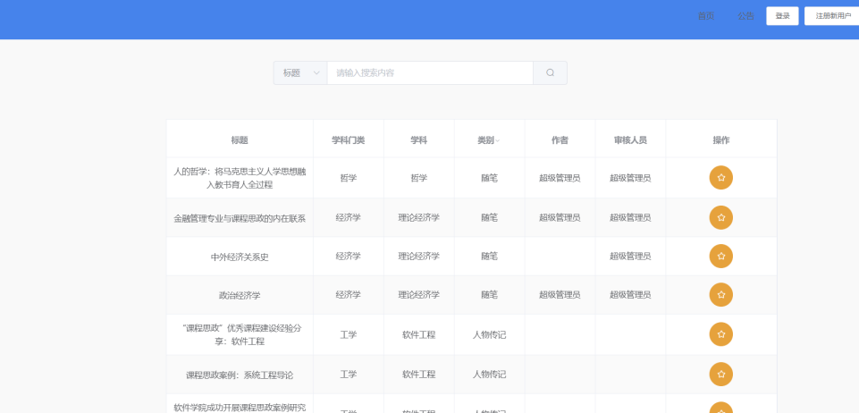
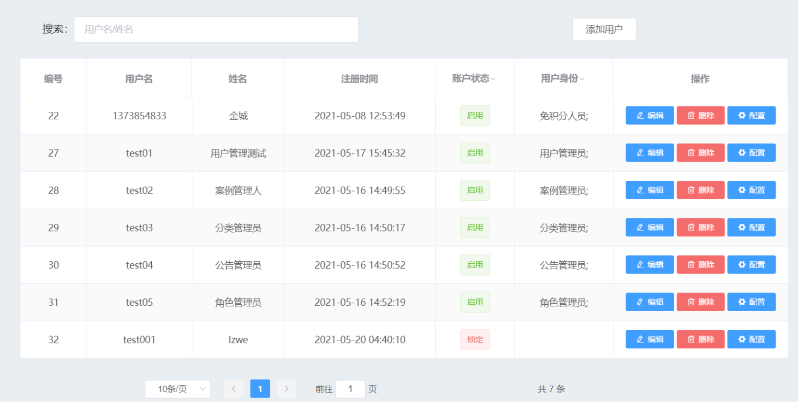

> 项目名：课程思政库案例库
> 用户界面如下

## 用户案例检索页
案例检索页是案例的检索页面，可以通过标题、作者、关键词、学科、类别进行案例检索。标题、作者、关键词需要输入内容进行检索，学科、类别则根据案例库已有的内容选择检索。检索结果可在登录后收藏。第二次登录时，系统根据上次用户的使用情况来向用户推荐相关的思政案例，用户也可收藏自己喜欢的相关案例如图10所示。

用户管理页可以对案例库中已有的用户进行管理，列表中展示用包括用户名、姓名、用户角色分组等信息，除了可以在输入框中利用用户的用户名和姓名查找用户外，还可以在表格上按照账号状态等对用户尽心筛选，以及对任意一条信息进行编辑、删除、配置操作
