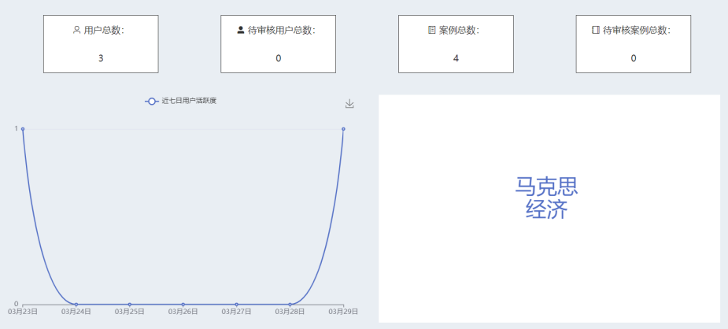
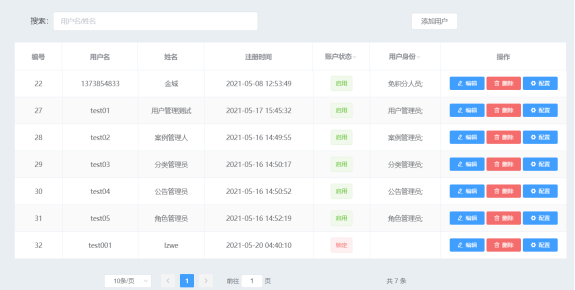

> 项目名：课程思政库案例库
> 管理员界面如下
##首页
后台首页展示了案例库的一些基本数据信息，包括用户总数、待审核用户总数、案例总数、待审核案例总数，还引入Echarts库以图表的形式展示案例库的用户活跃度，使用词云展示关键词检索的热度。

##用户管理页
用户管理页可以对案例库中已有的用户进行管理，列表中展示用包括用户名、姓名、用户角色分组等信息，除了可以在输入框中利用用户的用户名和姓名查找用户外，还可以在表格上按照账号状态等对用户尽心筛选.

##其他页面
其他还有学科管理页、类别管理页、案例管理页、公告管理页与上述内容相似。管理员的页面编辑操作、分页操作和用户的操作相似，
